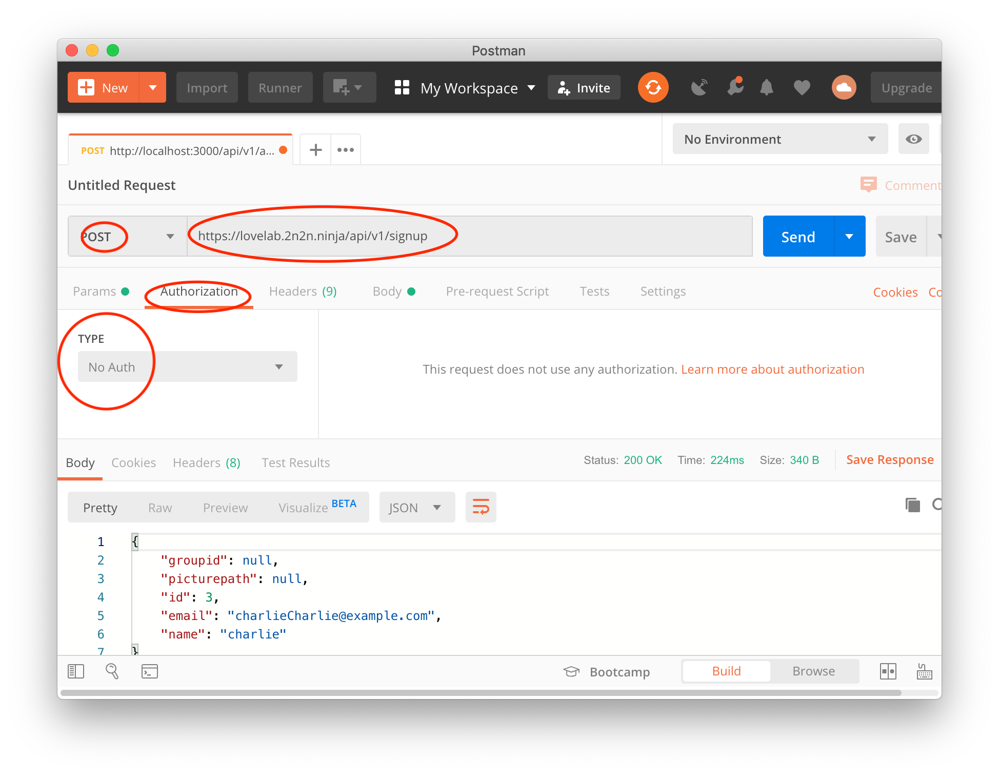
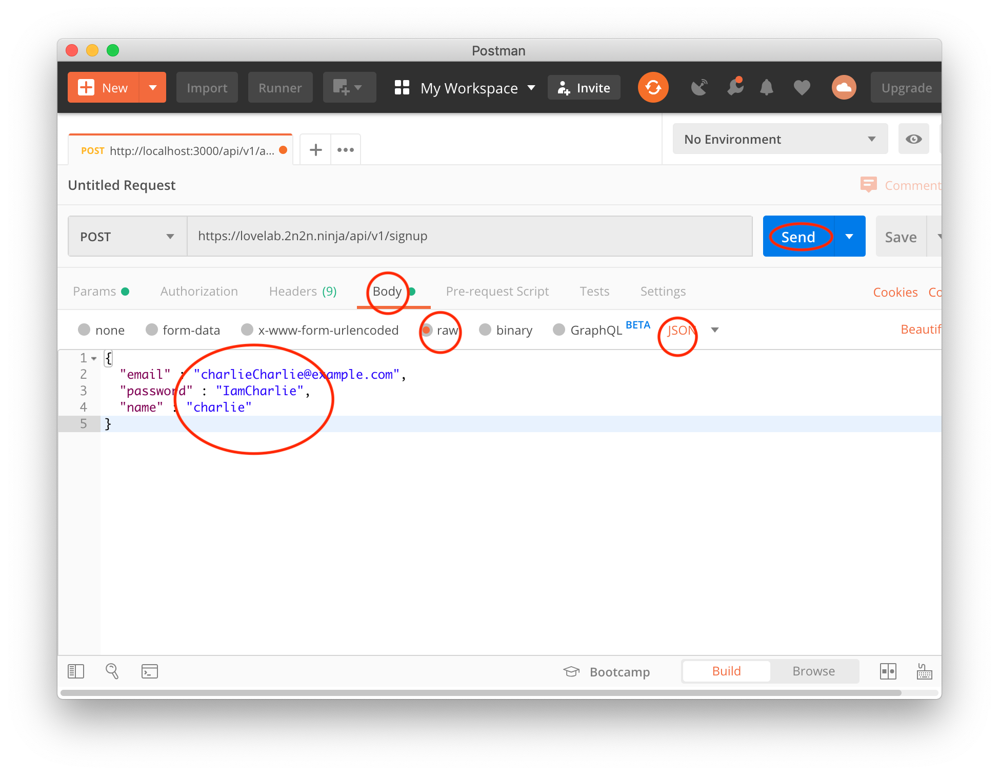

# 3. 実際にAPIと通信してみる

[もくじに戻る](index.md)

以下では、terminalのcrulコマンドと[Postman](https://www.getpostman.com/)で実際にAPIと通信する手順を解説する。

## 3.1. 認証無しのリクエストを試してみる

### 3.1.1. curlで通信

```sh
# ユーザ登録
$ curl "https://lovelab.pw/api/v1/signup" \
       -X POST \
       -H "Content-Type: application/json" \
       -d '{"email":"charlie@example.com","password":"charlie-password","name":"charlie"}' 
# ログイン(Beaerトークンを取得)
$ curl "https://lovelab.pw/api/v1/login" \
       -X POST \
       -H "Content-Type: application/json" \
       -d '{"email":"charlie@example.com","password":"charlie-password"}' 
```

### 3.1.2. Postmanで通信

1. HTTPリクエストメソッドを`POST`に設定 (画像1枚目)
1. URIを(`https://lovelab.pw/api/v1/ ... `に適宜設定 (画像1枚目)
1. AuthorizationタブのTYPEを`No Auth`に設定 (画像1枚目)
1. Bodyタブにて形式を`raw`かつ`JSON`に設定 (画像2枚目)
1. リクエストボディのJSONを入力 (画像2枚目)
1. Sendをクリックしてリクエストを送信 (画像2枚目)
1. 画面下部にレスポンスの内容が表示される





## 3.2. 認証付きのリクエストを試してみる

### 3.2.1. curlで通信

terminalで次のコマンドを実行

```sh
# ユーザ情報を取得
$ curl "https://lovelab.pw/api/v1/authed/users/1" \
       -H "Content-Type: application/json" \
       -H "Authorization: Bearer xxxx" \
       -X GET
# xxxx は取得したAPIキーに置き換えること
```

### 3.2.2. Postmanで通信

1. リクエストのAuthorizationタブを開き、TYPEを`Bearer Token`に設定
1. Tokenにトークンを入力
1. HTTPリクエストメソッド(GET,POST,PUT,DELETE)を設定
1. URIを設定
1. (必要があれば)リクエストのBodyタブでrawを選択し、JSONを設定
1. Send
1. 画面下部にレスポンスの内容が表示される


### 3.2.3. Swiftで送信する

未調査... 頑張ってください....

[もくじに戻る](index.md)
